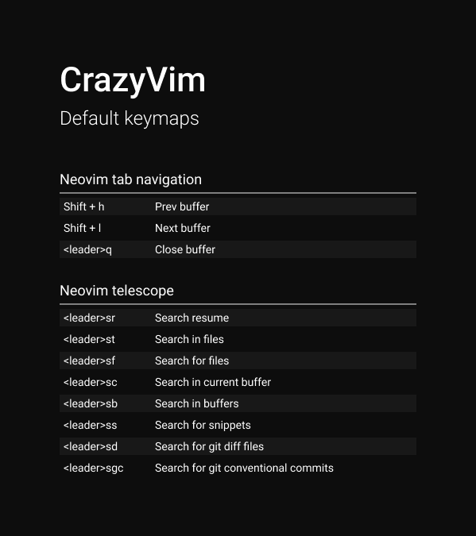

# 💤 CrazyVim

Custom configuration based on [LazyVim](https://github.com/LazyVim/LazyVim).
Refer to the [documentation](https://lazyvim.github.io/installation) to get more information.

## Keymaps



## Customization Options

To personalize your Neovim configuration, you can create a `custom.lua` file in the root directory of your Neovim configuration.

#### Setting Your Preferred Colorscheme

You can easily set your preferred colorscheme using the `colorscheme` option in `custom.lua`. Here's an example of how to do it:

```lua
return {
  colorscheme = "dracula",
  --            "dracula"
  --            "github_dark_high_contrast"
  --            "catppuccin-mocha"
}
```
